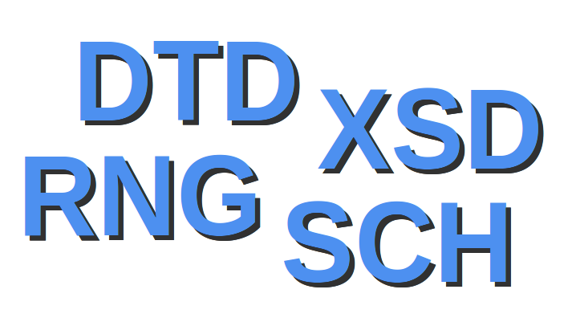

# Validación de ficheros XML



## XML Bien Formado

Un XML bien formado:

- Incluirá una declaración XML al inicio con:
      - Versión (obligatoria): la más utilizada es 1.0, aunque ya está disponible la  1.1.
      - Codificación de caracteres (opcional): normalmente UTF-8 o UTF-16.
      - Si es independiente (standalone=”yes”) o se depende de validadores externos (standalone=”no”, opción por defecto).
- Sólo existe un único elemento raíz.
- Todos los elementos se encuentran anidados y correctamente cerrados.
- Los valores de atributos deben ir entre comillas simples o dobles.
- Los elementos vacíos deben terminar con '/' (autocierre) o añadiendo una etiqueta de fin.
- Es sensible a mayúsculas y minúsculas
- Los nombres de las etiquetas pueden ser alfanuméricos, pero siempre comenzando con una letra.

Ejemplo:

```
<? xml version="1.0" encoding="UTF-8" standalone="no" ?>
<nota id="1">
  <remitente>Miguel</remitente>
  <destinatario>Jorge</destinatario>
  <titulo>Recordatorio</titulo>
  <mensaje>Recógeme este fin de semana</mensaje>
</nota>
```

## XML Válido

- Además de estar bien formados, cumplen las especificaciones de un DTD, un XSD, un RNG, o un SCH

### DTD (Document Type Definition)

[Tutorial DTD](http://www.zvon.org/xxl/DTDTutorial/General_spa/contents.html)

- Es el formato nativo y el más antiguo.
- Utiliza una sintaxis no-XML.
- Es el método más sencillo, pero presenta limitaciones.

### XSD (XML Schema Definition)

[Tutorial XSD](http://www.tic2.org/WebTecnica/Programacion/XSD/XSD.htm)

- Evolución de la DTD descrita por el W3C.
- Utiliza sintaxis XML.
- Es más complejo y potente.

### RNG (Relax NG - REgular LAnguage for XML Next Generation)

[Tutorial Relax NG](http://www.relaxng.org/compact-tutorial-20030326.html)

- Muy intuitivo y más fácil de entender que el XSD.
- Puede utilizar sintaxis XML o una propia parecida a JSON.
- Convertido recientemente en un estándar ISO.

### SCN (Schematron)

[Tutorial Schematron](http://www.zvon.org/xxl/SchematronTutorial/General/toc.html)

- Se basa en reglas en vez de en la gramática.
- Convertido recientemente en un estándar ISO.
- Utiliza sintaxis XML, donde se definen reglas.
